## Let's Solve a Classic Problem Together! 

Hey there! 👋 Today we're going to tackle one of the most famous coding interview questions: the Two Sum problem. Don't worry if you're new to algorithms - I'll walk you through it step by step, and by the end, you'll understand both the simple approach and the clever optimization.

Think of it like this: imagine you're at a grocery store with a shopping list, and you need to find two items whose prices add up to exactly the amount of cash you have in your wallet. That's essentially what we're doing here, but with numbers in an array!

## What Are We Trying to Solve?

Here's the challenge: You have an array of numbers and a target sum. Your job is to find two numbers in that array that add up to the target, and return their positions (indices).

**The Rules:**
- Each number can only be used once
- There's always exactly one correct answer
- You need to return the positions, not the actual numbers

## A Simple Example

```plaintext
Array: [2, 7, 11, 15]
Target: 9

Answer: [0, 1] (because 2 + 7 = 9)
```

Let's visualize this:

```mermaid
graph TD
    A["Array: [2, 7, 11, 15]"] --> B["Target: 9"]
    B --> C["Looking for two numbers that sum to 9"]
    C --> D["2 + 7 = 9 ✓"]
    D --> E["Return positions: [0, 1]"]
    
    style D fill:#90EE90
    style E fill:#87CEEB
```



## Two Ways to Solve This

I'm going to show you two approaches: the obvious one that anyone can think of, and then a clever trick that makes it much faster.

### The Obvious Way: Check Every Possible Pair

When I first encountered this problem, my brain immediately thought: "Let's just try every combination!" And you know what? That's totally valid thinking.

Here's how it works:
- Take the first number, try it with every other number
- Take the second number, try it with every remaining number  
- Keep going until you find the pair that adds up to your target

```mermaid
graph TD
    A["Start with [2, 7, 11, 15], target = 9"] --> B["Check 2 + 7 = 9 ✓"]
    A --> C["If that didn't work, check 2 + 11"]
    A --> D["If that didn't work, check 2 + 15"]
    A --> E["Then check 7 + 11, 7 + 15, etc."]
    
    B --> F["Found it! Return [0, 1]"]
    
    style B fill:#90EE90
    style F fill:#87CEEB
```



**Here's the Go code:**

```go
func twoSumBruteForce(nums []int, target int) []int {
    // Try every possible pair
    for i := 0; i < len(nums); i++ {
        for j := i + 1; j < len(nums); j++ {
            if nums[i] + nums[j] == target {
                return []int{i, j}  // Found it!
            }
        }
    }
    return []int{}  // No solution (shouldn't happen based on problem statement)
}
```

**Why this works:** We're literally checking every possible combination. If there's a solution, we'll definitely find it.

**The downside:** If you have 1000 numbers, you'd need to check about 500,000 pairs! That's a lot of work.

**Time complexity:** O(n²) - for each number, we check it against all other numbers  
**Space complexity:** O(1) - we only use a couple of variables

### The Clever Way: Use a Map to Remember What You've Seen

Now here's where it gets interesting! Instead of checking every pair, what if we could be smarter about it?

Think about it this way: when you're looking at the number 2 and your target is 9, you know you need to find a 7 somewhere. So instead of checking 2 against every other number, why not just ask: "Have I seen a 7 before?"

This is where a map (or hash table) comes in handy. As we go through the array, we'll:
1. Look at each number
2. Calculate what number we need to complete the pair (called the "complement")
3. Check if we've seen that complement before
4. If yes, we're done! If no, remember this number for later

Let me show you visually:


**Here's the Go code:**

```go
func twoSum(nums []int, target int) []int {
    // This map will remember: number -> its position
    numMap := make(map[int]int)
    
    for i, num := range nums {
        complement := target - num  // What number do we need?
        
        if index, exists := numMap[complement]; exists {
            // We've seen the complement before!
            return []int{index, i}
        }
        
        // Haven't found the complement yet, so remember this number
        numMap[num] = i
    }
    
    return []int{}  // No solution
}
```

**Why this is brilliant:** Instead of checking every pair (which takes forever), we only go through the array once and use our memory to instantly check if we've seen the number we need.

**Time complexity:** O(n) - we only go through the array once!  
**Space complexity:** O(n) - we might need to remember up to n numbers in our map

Let's trace through our example:

```plaintext
Array: [2, 7, 11, 15], Target: 9

Step 1: i=0, num=2
- Need: 9 - 2 = 7
- Is 7 in our map? No
- Remember: map[2] = 0

Step 2: i=1, num=7  
- Need: 9 - 7 = 2
- Is 2 in our map? Yes! At position 0
- Return [0, 1]
```

## Which Approach Should You Use?

Here's a comparison to help you decide:

```mermaid
graph LR
    A[Array Size] --> B{Small Array?<br/>< 100 elements}
    B -->|Yes| C[Brute Force<br/>✓ Simple<br/>✓ No extra memory<br/>⚠️ Slower]
    B -->|No| D[Hash Map<br/>✓ Much faster<br/>✓ Scales well<br/>⚠️ Uses more memory]
    
    style C fill:#FFE4B5
    style D fill:#98FB98
```



**Use the simple approach when:**
- You're just learning (it's easier to understand)
- The array is very small (less than 100 numbers)
- Memory is super limited
- You want the simplest possible code

**Use the map approach when:**
- Performance matters (which is most of the time)
- You're dealing with large arrays
- You're in a coding interview (they usually want the optimized solution)

## The Big Picture

This problem teaches us a fundamental principle in programming: sometimes you can trade memory for speed. The brute force approach uses almost no extra memory but is slow. The map approach uses more memory but is much faster.

This pattern shows up everywhere in programming:
- Caching (store results to avoid recalculating)
- Database indexing (use extra storage for faster lookups)
- Memoization (remember previous function results)

The key insight here is recognizing that for each number, we only care about whether its "complement" exists, not about checking all possible pairs. This shifts our thinking from "check everything" to "remember what matters."

## Wrapping Up

Congratulations! 🎉 You've just learned one of the most important problem-solving patterns in programming. The Two Sum problem might seem simple, but it introduces you to the powerful concept of using hash maps for optimization.

Here's what we covered:
- ✅ The straightforward brute force approach (checking every pair)
- ✅ The clever hash map optimization (trading memory for speed)  
- ✅ When to use each approach
- ✅ The bigger programming principle behind the optimization

The next time you encounter a problem where you're checking all possible combinations, ask yourself: "Is there a way I can remember something to avoid this repetitive work?" Often, the answer is yes, and a hash map might be your best friend.

Keep practicing, and remember - every expert was once a beginner who kept going! 💪

```mermaid
graph TD
    A[Start: Two Sum Problem] --> B[Try Brute Force First]
    B --> C[Understand the Pattern]
    C --> D[Learn Hash Map Optimization]
    D --> E[Apply to Other Problems]
    E --> F[Become an Algorithm Pro! 🎯]
    
    style F fill:#FFD700
```


